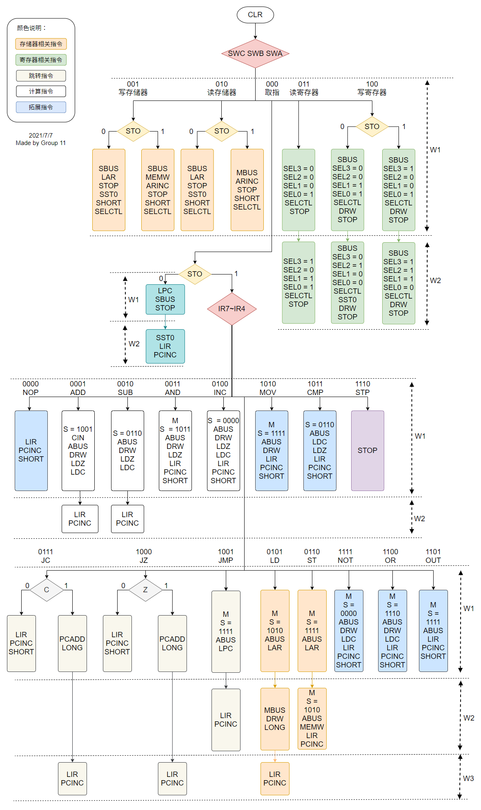
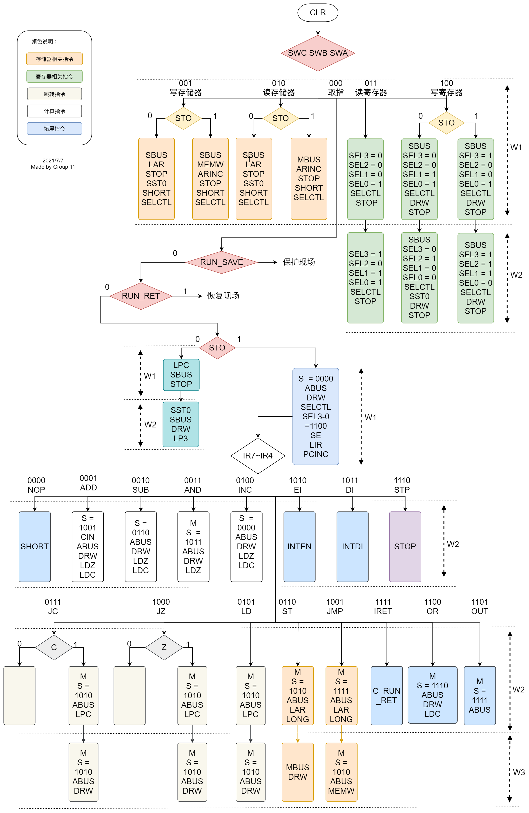
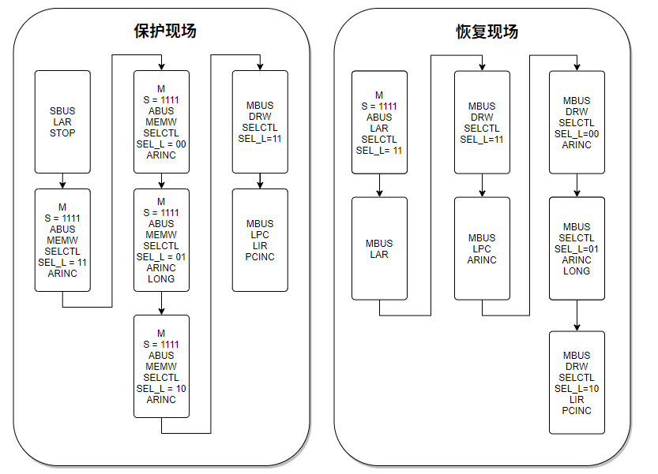

# BUPT Computer Architecture Course Design -- 一款基于 Altera EPM7128 的硬连线控制器

小组成员：

[@weikeduo1](https://github.com/weikeduo1)

[@Jaskon863](https://github.com/Jaskon863)

[@Monstry](https://github.com/Monstry)

@WadeChiang (me)

## Feature

### Pipeline version

- [x] 基础功能
- [x] 流水
- [ ] 中断

### Interrupt version

- [x] 基础功能
- [ ] 流水
- [x] 中断

## 设计流程图

### Pipeline version

说明：

为什么 ADD, SUB, JC, JZ, LD 要放弃流水，延迟一个机器周期取指？

这是 TEC-8 的硬件问题。如果你用全流水的版本测试过本课程的样例程序，你就会发现大多数 TEC-8 实验台会非常神奇地在 SUB 和 LD 这两个指令的取指中按相反的次序触发 LIR 和 PCINC 信号，于是你成功取到了下下条指令。在我们自己的测试程序中 ADD, JC , JZ 出现了相同的问题.尤其是 JC & JZ：把 W2 置为空周期，在 W3 取指就不会反序触发 LIR 和 PCINC ，在 W2 取指，不行，在 W3 取指，行。只能说哇，TEC-8，哇。

### Interrupt version

说明：

中断的实现方式：

由于 TEC-8 中唯一一个与 PC 有数据通路的中断寄存器 IAR 并没有引脚连接 EPM7128，所以我们无法直接读到 PC 的数据并将其存在 RAM 中。因此，在中断版本中我们牺牲了一个寄存器 R3，令其始终与 PC 的值保持同步，通过在断点保存程序中保存 R3 实现 PC 的存储。

我们遇到的另一个困难是， EMP7128 没有任何信号直接连接总线，因此不可能通过控制器控制应该在哪里储存寄存器值，以及哪里是中断服务程序的入口地址。为了完成中断，我们需要三个地址：

1. 中断现场的存储地址。我们通过中断服务程序的第一个机器周期，用开关 S7-S0 将其置入 AR 中。
2. 中断服务程序的入口地址。在向 RAM 中写入程序时预置。假设中断现场的存储首地址为 ADDR0, 中断服务程序的入口地址为 ADDR1，那么 [ADDR0 + 4] = ADDR1。这样断点保存程序就可以获取中断服务程序入口 ADDR1，将其载入 PC 与 R3.
3. 中断现场的存储地址。中断服务程序结束后，仍需要获得 ADDR0 才能返回断点。若中断服务程序的最后一条指令 IRET（必须是它！）的地址为 ADDR2，那么 [ADDR2 +1] = ADDR0. 这样中断返回程序就能读取到它，并且将所有的寄存器值恢复原样。

## 最后

再碰 TEC-8 我就是狗。